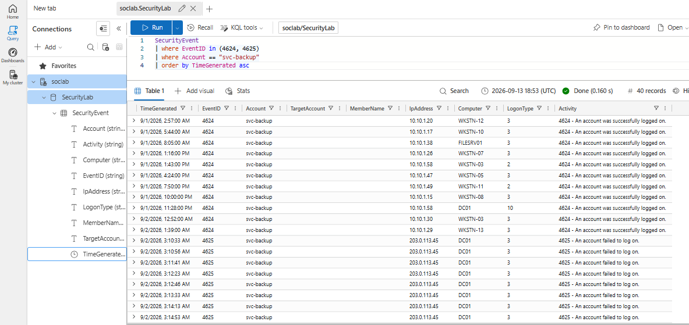
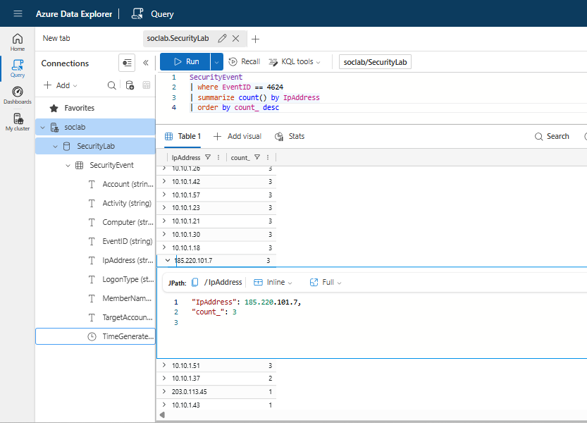
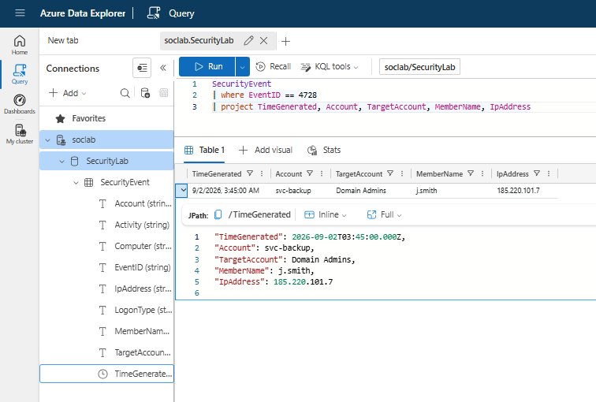
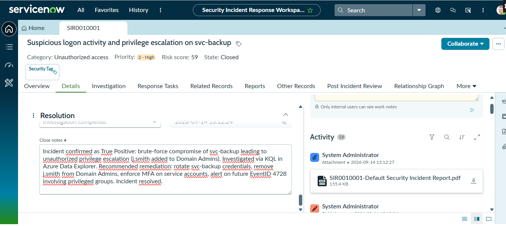

# SOC Investigation: Brute Force → Privilege Escalation (KQL + ServiceNow)

## Summary
Simulated SOC analyst project: queried Windows security event logs with **KQL** in **Azure Data
Explorer** to detect a brute-force logon followed by unauthorized privilege escalation, then
documented, triaged, and closed the finding as a security incident in **ServiceNow** (Security
Incident Response module).

## Tools used
- Azure Data Explorer (KQL) — free cluster, no cost
- ServiceNow Developer Instance — Security Incident Response app

## Scenario
A synthetic but realistic dataset of Windows `SecurityEvent` logs was used, containing normal
logon activity plus three planted anomalies to investigate.

## Investigation

### 1. Brute force detection
```kql
SecurityEvent
| where EventID in (4624, 4625)
| where Account == "svc-backup"
| order by TimeGenerated asc
```
**Finding:** 9 consecutive failed logons (`4625`) against `svc-backup` from `203.0.113.45`,
followed immediately by a successful logon (`4624`) — a classic brute-force-then-breakthrough
pattern.



### 2. Anomalous source IP
```kql
SecurityEvent
| where EventID == 4624
| summarize count() by IpAddress
| order by count_ desc
```
**Finding:** All legitimate logons came from the internal `10.10.1.x` range, except one from
`185.220.101.7` — an external address with no prior activity in the environment.



### 3. Privilege escalation
```kql
SecurityEvent
| where EventID == 4728
| project TimeGenerated, Account, TargetAccount, MemberName, IpAddress
```
**Finding:** `svc-backup` added `j.smith` to the `Domain Admins` group minutes after the
suspicious external logon — tying the compromised account directly to a privilege escalation
event.



## Incident response (ServiceNow)

| Field | Value |
|---|---|
| Short description | Suspicious logon activity and privilege escalation on svc-backup |
| Priority | 2 - High (Risk score 59) |
| Category | Unauthorized access |
| Source | SIEM |
| Verdict | True Positive |
| State | Closed |



**Close notes:** Incident confirmed as True Positive — brute-force compromise of `svc-backup`
leading to unauthorized privilege escalation (`j.smith` added to Domain Admins). Investigated via
KQL in Azure Data Explorer. Incident resolved.

## Recommendations
- Rotate credentials for `svc-backup` immediately
- Remove `j.smith` from `Domain Admins` pending review
- Alert on any future `EventID 4728` involving privileged groups
- Enforce MFA / conditional access on service accounts

## What I learned
Working through this project showed how a few `where` and `summarize` clauses in KQL can turn
hundreds of raw, noisy log rows into a clear signal — the `summarize count() by IpAddress` query
in particular is what surfaced the one external IP hiding among dozens of legitimate internal
ones. It also made the full SOC triage lifecycle concrete: an alert isn't "done" once you've
found something suspicious in the logs, it has to move through validation, impact assessment, a
documented verdict, and a formally closed ticket before the loop is actually closed.

---
*Dataset used: [`SecurityEvent_sample.csv`](SecurityEvent_sample.csv) — synthetic Windows
security event logs generated for this exercise.*
